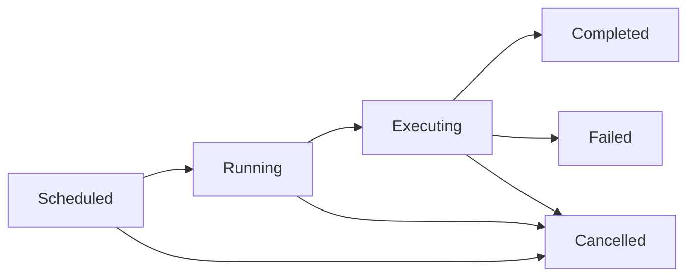

# Job Management

RaisinDB provides a comprehensive job management system for handling background tasks, maintenance operations, and long-running processes. The system includes real-time monitoring, cancellation support, and pluggable monitors for integration with external systems.

## Overview

The job management system is designed to:
- Track and manage background operations across all storage backends
- Provide real-time status updates via Server-Sent Events (SSE)
- Support job cancellation and progress tracking
- Enable automatic maintenance operations
- Allow custom job monitors for external integrations

## Job Types

RaisinDB supports several built-in job types:

### IntegrityScan
Performs comprehensive data integrity checks on a tenant's data.

```rust
// Schedule an integrity scan
let job_id = storage.schedule_integrity_scan("my-tenant", Duration::from_hours(6))?;
```

### IndexRebuild
Rebuilds property, reference, or child order indexes.

```rust
// Rebuild all indexes for a tenant
let stats = storage.rebuild_indexes("my-tenant", IndexType::All).await?;
```

### Compaction
Optimizes storage by compacting data files (RocksDB-specific).

```rust
// Trigger compaction for all tenants
let stats = storage.compact(None).await?;

// Compact specific tenant
let stats = storage.compact(Some("my-tenant")).await?;
```

### Backup
Creates point-in-time backups of tenant data.

```rust
// Backup a specific tenant
let info = storage.backup_tenant("my-tenant", Path::new("/backups")).await?;

// Backup all tenants
let infos = storage.backup_all(Path::new("/backups")).await?;
```

### OrphanCleanup
Removes orphaned nodes and dangling references.

```rust
// Clean up orphans for a tenant
let count = storage.cleanup_orphans("my-tenant").await?;
```

## Job Lifecycle

Jobs progress through the following states:

```rust
pub enum JobStatus {
    /// Job is scheduled but not yet running
    Scheduled,

    /// Worker claimed job, about to spawn handler
    Running,

    /// Handler task actively running (seconds to minutes)
    Executing,

    /// Job completed successfully
    Completed,

    /// Job was cancelled by user
    Cancelled,

    /// Job failed with an error
    Failed(String),
}
```

### State Transitions



## Using the Job Registry

The global job registry tracks all background jobs:

```rust
use raisin_storage::jobs::{global_registry, JobType};

// Register a new job
let job_id = global_registry().register_job(
    JobType::IntegrityScan,
    Some("tenant-123".to_string()),
    None, // No JoinHandle
    None, // No cancellation token
    None, // Default max retries (3)
).await?;

// Update job status
global_registry().mark_running(&job_id).await?;

// Update progress
global_registry().update_progress(&job_id, 0.5).await?; // 50% complete

// Complete the job
global_registry().mark_completed(&job_id).await?;

// Or mark as failed
global_registry().mark_failed(&job_id, "Error message".to_string()).await?;
```

## Job Monitoring

### Built-in Monitors

#### LoggingMonitor
Logs all job events to the configured logger:

```rust
use raisin_storage::jobs::{LoggingMonitor, global_registry};
use std::sync::Arc;

let monitor = Arc::new(LoggingMonitor);
global_registry().monitors().add_monitor(monitor).await;
```

### Custom Monitors

Implement the `JobMonitor` trait for custom integrations:

```rust
use raisin_storage::jobs::{JobMonitor, JobEvent, JobInfo};
use async_trait::async_trait;

struct RedisMonitor {
    client: redis::Client,
}

#[async_trait]
impl JobMonitor for RedisMonitor {
    async fn on_job_update(&self, event: JobEvent) {
        // Publish job status to Redis
        let mut conn = self.client.get_async_connection().await.unwrap();
        let data = serde_json::to_string(&event).unwrap();
        let _: () = redis::cmd("PUBLISH")
            .arg("job_updates")
            .arg(data)
            .query_async(&mut conn)
            .await
            .unwrap();
    }

    async fn on_job_created(&self, job: &JobInfo) {
        // Handle new job creation
    }

    async fn on_job_removed(&self, job_id: &JobId) {
        // Handle job removal
    }

    async fn on_job_progress(&self, job_id: &JobId, progress: f32) {
        // Handle progress updates
    }
}
```

### Server-Sent Events (SSE)

RaisinDB Server provides SSE endpoints for real-time job updates:

```javascript
// Connect to job events stream
const eventSource = new EventSource('/management/events/jobs');

eventSource.addEventListener('job-update', (event) => {
    const data = JSON.parse(event.data);
    console.log(`Job ${data.job_id}: ${data.status}`);
});

// Initial state events are sent on connection
eventSource.onopen = () => {
    console.log('Connected to job updates');
};
```

## Background Jobs in Storage Implementations

### RocksDB Storage

RocksDB storage includes automatic background jobs:

```rust
use raisin_storage_rocks::RocksStorage;
use raisin_storage::BackgroundJobs;

let storage = RocksStorage::open("./.data/rocks")?;

// Start background jobs (integrity scanning, auto-healing, etc.)
storage.start_background_jobs()?;
```

Background jobs configuration:

```rust
// Schedule periodic integrity scan
storage.schedule_integrity_scan(
    "my-tenant",
    Duration::from_hours(6), // Run every 6 hours
)?;
```

### In-Memory Storage

In-memory storage provides stub implementations for testing:

```rust
use raisin_storage_memory::InMemoryStorage;
use raisin_storage::BackgroundJobs;

let storage = InMemoryStorage::default();

// Start background jobs (no-op for in-memory)
storage.start_background_jobs()?;
```

## Management API

The HTTP management API provides endpoints for job operations:

### List All Jobs
```http
GET /management/jobs
```

Response:
```json
{
  "success": true,
  "data": [
    {
      "id": "job_abc123",
      "job_type": "IntegrityScan",
      "status": "Running",
      "tenant": "tenant-123",
      "started_at": "2024-01-15T10:30:00Z",
      "progress": 0.75
    }
  ]
}
```

### Get Job Status
```http
GET /management/jobs/{id}
```

### Cancel Job
```http
POST /management/jobs/{id}/cancel
```

### Schedule Integrity Scan
```http
POST /management/jobs/schedule/integrity
Content-Type: application/json

{
  "tenant": "tenant-123",
  "interval_minutes": 360
}
```

## Job Cancellation

Jobs can be cancelled using cancellation tokens:

```rust
use tokio_util::sync::CancellationToken;
use std::sync::Arc;

// Create cancellation token
let cancel_token = Arc::new(CancellationToken::new());

// Register job with cancellation support
let job_id = global_registry().register_job(
    JobType::Backup,
    Some("tenant-123".to_string()),
    None,
    Some(cancel_token.clone()),
    None, // Default max retries
).await?;

// In job implementation, check for cancellation
tokio::select! {
    _ = cancel_token.cancelled() => {
        // Clean up and exit
        return Err("Job cancelled".into());
    }
    result = do_work() => {
        // Continue with work
    }
}

// Cancel the job
global_registry().cancel_job(&job_id).await?;
```

## Progress Tracking

Jobs can report progress for long-running operations:

```rust
async fn rebuild_indexes(tenant: &str) -> Result<()> {
    let job_id = /* ... */;
    let total_items = 1000;

    for (i, item) in items.iter().enumerate() {
        // Process item
        process_item(item).await?;

        // Update progress
        let progress = (i as f32) / (total_items as f32);
        global_registry().update_progress(&job_id, progress).await?;
    }

    Ok(())
}
```

## Auto-Healing

RocksDB storage includes automatic healing capabilities:

```rust
// Enable auto-healing during integrity scans
let scan_interval = Duration::from_hours(6);
let auto_heal = true;

start_integrity_scanner(
    storage.clone(),
    "tenant-123".to_string(),
    scan_interval,
    auto_heal, // Automatically fix issues
).await;
```

Auto-healing can fix:
- Missing indexes
- Inconsistent references
- Orphaned nodes
- Corrupted metadata

## Best Practices

### 1. Use Appropriate Job Types
Choose the right job type for your operation to ensure proper tracking and monitoring.

### 2. Implement Progress Updates
For long-running jobs, regularly update progress to provide visibility.

### 3. Handle Cancellation Gracefully
Check cancellation tokens periodically and clean up resources when cancelled.

### 4. Monitor Job Health
Use the health status endpoint to monitor overall job system health:

```http
GET /management/health
```

### 5. Clean Up Old Jobs
Periodically clean up completed jobs to prevent memory growth:

```rust
// Remove jobs older than 24 hours
global_registry().cleanup_old_jobs(chrono::Duration::hours(24)).await;
```

### 6. Use SSE for Real-Time UI
Connect to SSE endpoints for live updates instead of polling:

```javascript
const eventSource = new EventSource('/management/events/jobs');
// Automatic reconnection on disconnect
```

## Example: Complete Job Workflow

```rust
use raisin_storage::jobs::{global_registry, JobType};
use tokio_util::sync::CancellationToken;
use std::sync::Arc;

async fn perform_backup(tenant: &str, dest: &Path) -> Result<()> {
    // Create cancellation token
    let cancel_token = Arc::new(CancellationToken::new());

    // Register job
    let job_id = global_registry().register_job(
        JobType::Backup,
        Some(tenant.to_string()),
        None,
        Some(cancel_token.clone()),
        None, // Default max retries
    ).await?;

    // Mark as running
    global_registry().mark_running(&job_id).await?;

    // Perform backup with progress updates
    let total_nodes = count_nodes(tenant).await?;
    let mut processed = 0;

    for batch in get_node_batches(tenant) {
        // Check for cancellation
        if cancel_token.is_cancelled() {
            global_registry().update_status(&job_id, JobStatus::Cancelled).await?;
            return Err("Backup cancelled".into());
        }

        // Process batch
        backup_batch(&batch, dest).await?;
        processed += batch.len();

        // Update progress
        let progress = (processed as f32) / (total_nodes as f32);
        global_registry().update_progress(&job_id, progress).await?;
    }

    // Mark as completed
    global_registry().mark_completed(&job_id).await?;

    Ok(())
}
```

## Troubleshooting

### Jobs Stuck in Running State
- Check if the job implementation properly updates status on completion/failure
- Verify cancellation tokens are being checked
- Look for deadlocks or infinite loops

### SSE Connection Drops
- SSE includes automatic keep-alive messages every 30 seconds
- Clients should implement reconnection logic
- Check proxy/load balancer timeout settings

### High Memory Usage
- Clean up old completed jobs regularly
- Limit the number of concurrent jobs
- Use appropriate channel buffer sizes for monitors

### Job Not Starting
- Verify background jobs are started: `storage.start_background_jobs()`
- Check for errors in job registration
- Ensure storage backend supports the job type

## See Also

- [Management API Reference](../api/management-api.md)
- [Storage Backends](../architecture/storage-backends.md)
- [Multi-Tenancy](../architecture/multi-tenancy.md)