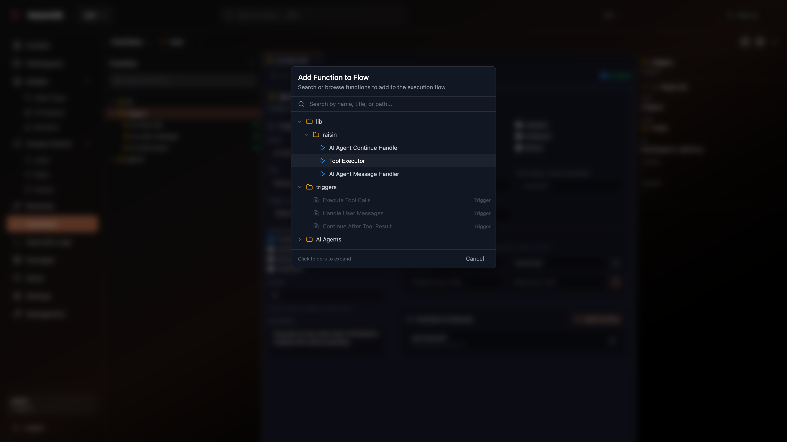
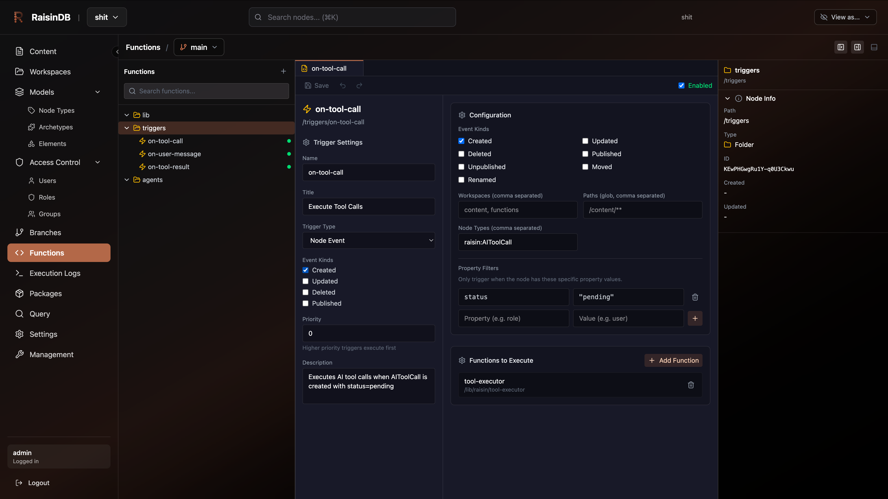

# AI Tools Package

A comprehensive AI-powered toolkit for RaisinDB that enables intelligent content generation, conversational AI agents, and automated workflows.

## Features

- **AI Prompts** - Create and manage reusable prompt templates
- **AI Conversations** - Build multi-turn conversational experiences
- **AI Agents** - Deploy autonomous agents with tool-calling capabilities
- **AI Tasks & Plans** - Orchestrate complex AI workflows

## Screenshots

### Agent Configuration



Configure your AI agents with custom system prompts, tool access, and behavioral settings.

### Conversation View



Real-time conversation interface with message threading and tool call visualization.

## Installation

Install this package from the RaisinDB admin console:

1. Navigate to **Packages** in the sidebar
2. Find **AI Tools** in the available packages
3. Click **Install** and select your preferred install mode

## Node Types

This package provides the following node types:

| Node Type | Description |
|-----------|-------------|
| `raisin:AIPrompt` | Reusable prompt templates with variable interpolation |
| `raisin:AIConversation` | Multi-turn conversation containers |
| `raisin:AIMessage` | Individual messages within conversations |
| `raisin:AIModel` | Model configuration and parameters |
| `raisin:AIAgent` | Autonomous agent definitions |
| `raisin:AIThought` | Agent reasoning traces |
| `raisin:AITask` | Discrete task definitions |
| `raisin:AIPlan` | Multi-step execution plans |
| `raisin:AIToolCall` | Tool invocation records |
| `raisin:AIToolResult` | Tool execution results |

## Quick Start

### Creating an AI Agent

```yaml
node_type: raisin:AIAgent
name: my-assistant
properties:
  title: My Assistant
  system_prompt: |
    You are a helpful assistant that answers questions
    about the RaisinDB documentation.
  model: gpt-4
  temperature: 0.7
  tools:
    - search_docs
    - create_note
```

### Creating a Prompt Template

```yaml
node_type: raisin:AIPrompt
name: summarize-template
properties:
  title: Document Summarizer
  template: |
    Summarize the following document in {{style}} style:

    {{content}}
  variables:
    - name: style
      default: concise
    - name: content
      required: true
```

## Workspaces

This package creates the `ai` workspace for organizing AI-related content:

- `/agents` - Agent definitions
- `/prompts` - Prompt templates
- `/conversations` - Active conversations

## Functions & Triggers

The package includes serverless functions for AI operations:

- `agent-handler` - Processes agent requests
- `agent-continue-handler` - Handles multi-turn continuations
- `on-user-message` - Trigger for new user messages
- `on-tool-result` - Trigger for tool execution results

## Configuration

Configure AI model providers in your RaisinDB settings:

```yaml
ai:
  providers:
    openai:
      api_key: ${OPENAI_API_KEY}
      default_model: gpt-4
    anthropic:
      api_key: ${ANTHROPIC_API_KEY}
      default_model: claude-3-opus
```


raisindb package create ./ai-tools      

raisindb package upload ai-tools-1.0.0.rap -r social_feed_demo_rel4

## License

MIT License - See LICENSE file for details.

---

*Built with RaisinDB Package System*
